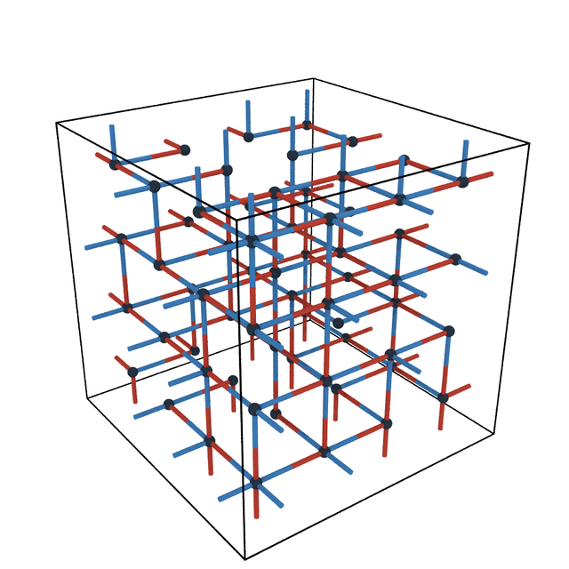
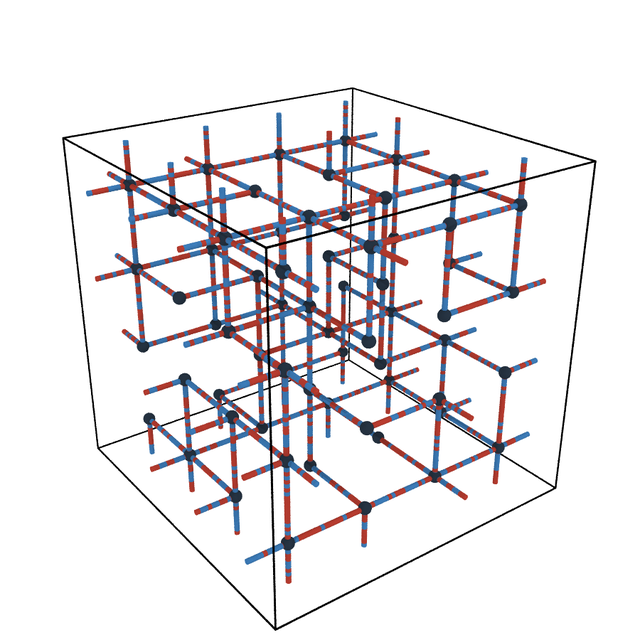
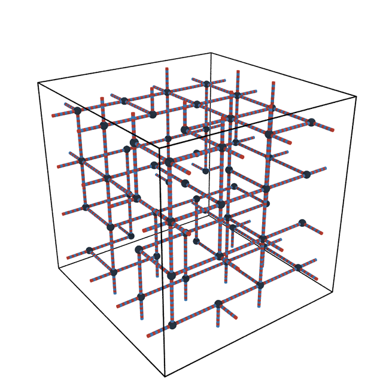
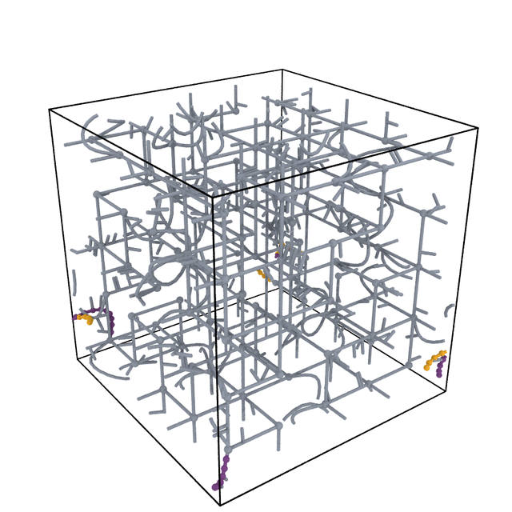
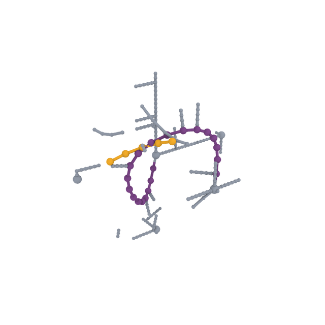

<p align="center">
  
</p>

<p align="center">
  <sub>Not an illustration: the network is generated by topon's own strict-sculpting generator, the letters are a colouring of the strands, the pinches inside them are real entanglement kinks, and the motion is a Kremer–Grest (FENE&nbsp;+&nbsp;WCA) minimisation and equilibration run in LAMMPS. <a href="assets/logo/">How it was made →</a></sub>
</p>

# Topon — Topological Polymer Network Generator

**Topon** builds polymer and protein network structures for molecular dynamics.
Its premise is that **connectivity comes first**: you define the network as a
graph, and only then map that graph onto chemistry. The same graph can be emitted
as a coarse-grained Kremer–Grest melt or as an all-atom DREIDING system, which
makes the two directly comparable.

```
Topology → Analysis → Assignment → Chemistry → Conformation → Output
```

Each stage is a separate module with one job. Details in
[docs/ARCHITECTURE.md](docs/ARCHITECTURE.md).

## Networks, not perfect grids

topon builds a network as a **graph on a lattice**, then strings every edge with
beads or atoms. The graph is not the bare lattice: the **strict-sculpting**
generator thins it to a target degree distribution, so junctions carry a real
spread of functionality (here 2–6, mean **4.0** — a tetrafunctional crosslinked
network) instead of every node sitting at 6. That is a heterogeneous network, the
way a real crosslinked polymer is; a perfect cubic grid is exactly what topon
exists to avoid.

The as-built state is then deliberately unphysical: the chains are strung taut
between junctions, `dp` beads to an edge, so their bonds start badly compressed —
**0.17 σ against a Kremer–Grest equilibrium of 0.97**, and in the atomistic system
a **0.44 Å** median against a 1.09 Å C–H (the Si–O backbone bond is 1.587 Å).
**MD is what makes it real**: the chains coil out to their natural length and the
lattice becomes a melt. The junctions do not stay put — by the end they have
wandered ~0.6 of a lattice spacing — but the **connectivity** you specified is
exactly preserved.

The same pipeline runs at both resolutions. The animations below are **real MD
trajectories** — the lattice you build, minimised and equilibrated in LAMMPS,
looping forward and back. Every number was measured back out of the run
([how, and how to rebuild them](assets/gallery/)).

<table>
<tr>
<td width="50%"></td>
<td width="50%"></td>
</tr>
<tr>
<td><b>Coarse-grained</b> — a 5×5×5 lattice sculpted 375 → <b>250</b> edges (junction functionality 2–6, mean 4.0): 5 125 beads, 250 strands of DP&nbsp;20, 18.2&nbsp;σ box. Bonds go <b>0.17&nbsp;σ → 0.96 → 0.97</b> as the taut lattice coils to the Kremer–Grest equilibrium (soft push-off + LJ ramp, then FENE&nbsp;+&nbsp;NVT).</td>
<td><b>Atomistic</b> — the same construction in DREIDING PDMS, likewise sculpted (3×3×3, 81 → 54 edges, mean degree 4.0): 10 896 atoms, 53.2&nbsp;Å box, gold Si and red O tracing the siloxane backbone. Bonds expand <b>0.44&nbsp;Å → 1.12&nbsp;Å</b> as the lattice inflates and the strands coil into a melt.</td>
</tr>
</table>

<sub>The loops are boomerangs (forward then reversed), so they are seamless. Higher-quality MP4s for slides: <a href="assets/gallery/anim/cg_arc.mp4">CG</a>, <a href="assets/gallery/anim/atom_arc.mp4">atomistic</a>, <a href="assets/gallery/anim/copoly_arc.mp4">copolymer</a>.</sub>

### Copolymer sequences

The same heterogeneous network, different chemistry along each strand — red = A,
blue = B, 50/50 on a sculpted 4×4×4 lattice (128 strands of DP&nbsp;20). The A/B
pattern is set at build time and survives into the melt:

<table>
<tr>
<td width="50%"></td>
<td width="50%">
<b>A block copolymer, lattice → melt.</b> Each strand is drawn half A (red), half B (blue) on the lattice, and stays that way as the network coils into a melt — the sequence is a property of the chain, not of the geometry. Same MD arc as above (soft-push inflation, then relax).
</td>
</tr>
</table>

<table>
<tr>
<td width="33%"></td>
<td width="33%"></td>
<td width="33%"></td>
</tr>
<tr>
<td><b>Block</b><br><sub><code>AAAAAAAAAABBBBBBBBBB</code> — every strand half red, half blue.</sub></td>
<td><b>Random</b><br><sub>Each strand an independent draw; no two alike (B fraction ≈ 0.5).</sub></td>
<td><b>Alternating</b><br><sub><code>ABABABAB…</code> — red and blue so finely interleaved the strands read purple.</sub></td>
</tr>
</table>

<sub><code>gradient</code> is also offered, but is not shown here: <b>it ignores the
composition you ask for</b>. Its weight window is scaled by the number of monomers,
so for two of them the ranges never overlap and nothing ever blends — it emits a
hard 50:50 split regardless (ask for A=0.1 and you still get A=0.50). At equal
fractions and even DP that split is <i>byte-identical to <code>block</code></i>.
See <a href="docs/JOURNAL.md">JOURNAL</a>.</sub>

### Entanglements and side chains

<table>
<tr>
<td width="55%"></td>
<td width="45%"></td>
</tr>
<tr>
<td><b>The whole network</b><br><sub>Ask for 12 entanglements and <b>24 strands</b> bow off the lattice (gold) — two per entanglement, since the assignment stage refuses to reuse an edge. The other 226 stay dead straight: bow 0.00. Teal = grafted side chains, DP&nbsp;5 (259 of them).</sub></td>
<td><b>One pair, close up</b><br><sub>The two partners (gold, violet) leave their own lattice edges, neck together and cross — closest approach <b>0.39&nbsp;σ</b>. Neither is a lattice edge any more; that is the kink.</sub></td>
</tr>
</table>

## Key features

**Topology**
- Simple-cubic, BCC and FCC lattices, plus a **strict-sculpting** generator that
  hits a target edge count or degree distribution — giving a real degree spread
  instead of a perfect lattice.
- **No compiler required.** A C generator is used when you point at one; otherwise
  a pure-Python port runs, intended to reproduce it.
- Load an existing graph from `.nodes`/`.edges`/`.gpickle` files, or hand a
  NetworkX graph straight to the Python API (which skips stages 1–3 and expects
  the types already assigned).
- **Lattice chain-growth topology** for the protein sub-system — self-avoiding
  walks with excluded volume on a 6-neighbour cubic lattice, with union-find
  gel-point detection.

**Chemistry — dual resolution from one graph**
- **Coarse-grained** — Kremer–Grest (FENE *K*=30, *R*₀=1.5; LJ/WCA).
- **Atomistic** — DREIDING, with PDMS, fluorinated, phenyl and POSS chemistries.
- **Copolymers** — block, random, alternating (a `gradient` mode exists but
  currently returns `block` for two monomers — see the note above).
- **Grafts / side chains**, **defect injection** with valence protection, and
  **POSS junctions** (Si₈O₁₂ cages).
- **Entanglements** — Gaussian-kink geometry. Both strands of a pair are pushed
  off their lattice edges to neck together and cross, as real coordinates, while
  the chain is built (chemistry stage).

**Proteins**
- **MARTINI 3** — `topon.protein_network` ("topro"), built from a residue-sequence
  string.
- **CHARMM36m all-atom** — an internal-coordinate/NeRF builder. With
  `--physical-backbone` (opt-in; the default is a seeded-jitter placement) it
  builds the backbone from the RTF IC tables: deterministic L-chirality, trans
  omega with a tunable X-Pro cis fraction, and omega + chirality restraints
  carried through minimisation. Ships the CHARMM36m RTF, PRM and CMAP data.
- **Dityrosine crosslinks** placed at build time as harmonic SC4–SC4 bonds
  (0.270 nm), from the lattice snapshot's crosslink list.
  `crosslink_method="none"` emits the uncrosslinked structure instead — the
  starting point for forming them in-situ under LAMMPS `fix bond/react` (that
  reaction template is not shipped here; the in-repo `bond/react` templates are
  simbox's epoxy-amine).

**Analysis & output**
- LAMMPS data + input decks, ready to run.
- **GraphML / NPZ** dual-graph export, for feeding networks to ML pipelines.
- Graph statistics, loop and entanglement candidate counts, and per-run stage
  summaries (`topon analyze`, `topon inspect`).

**Sub-systems** — these sit beside the network pipeline rather than inside it:
- **simbox** — independent molecule packer for crosslinking studies
  (epoxy-PDMS, amino-PDMS, AM0270-POSS), including `fix bond/react`.
- **topro** — protein networks, MARTINI 3 and CHARMM36m.
- **singlechain** — one chain in explicit solvent, with Hansen solubility
  parameters. Unrelated to network generation; effectively a separate tool that
  happens to live here.

## Installation

```bash
git clone https://github.com/lynspica/topon-dev.git
cd topon-dev
pip install -e .
```

LAMMPS (`lmp` on `PATH`) is required only to *run* generated systems, not to
generate them.

## Quick start

```bash
topon init --output my_run.json        # starter config (--interactive, --preset also work)
topon generate my_run.json --output ./runs
```

Other commands: `topon` on its own opens an interactive session; `topon doctor`
lints a config; `topon inspect` summarises a generated system; `topon recipes`
lists worked examples; `topon analyze` reports graph statistics.

Ready-to-run configs live in [`examples/demos/`](examples/) (polymer CG and
atomistic, protein MARTINI and CHARMM, topology). Full CLI reference and the JSON
schema: [docs/USAGE.md](docs/USAGE.md).

## Tests

```bash
pytest -m fast              # 173 unit tests, ~15 s
pytest -m "fast or smoke"   # + end-to-end at small scale (runs LAMMPS if `lmp` is on PATH)
pytest -m regression        # byte-equivalence vs frozen goldens
```

`requires_lammps` tests skip automatically when `lmp` is absent. The regression
tier compares against reference runs in `tests/output/`, which is **gitignored** —
those tests skip on a fresh clone until the references are generated locally.

## Documentation

| Document | Description |
|---|---|
| [AGENTS.md](AGENTS.md) | **AI-agent onboarding** — read this first if you (or your AI assistant) are new to the project |
| [docs/USAGE.md](docs/USAGE.md) | **How to run topon** — CLI reference, sub-system APIs, recipes, JSON-config schema (appendix) |
| [docs/ARCHITECTURE.md](docs/ARCHITECTURE.md) | **How topon is organised** — six-stage pipeline, module map, design principles |
| [docs/DEVELOPMENT.md](docs/DEVELOPMENT.md) | Version-by-version history + Q→R→R→R methodology |
| [docs/JOURNAL.md](docs/JOURNAL.md) | Engineering journal — dated entries on changes, issues, fixes |
| [CLAUDE.md](CLAUDE.md) | Rules every change must follow |
| [tests/VERSION_HISTORY.md](tests/VERSION_HISTORY.md) | Test-output directory reference map |
| [assets/gallery/](assets/gallery/) | Provenance for the images above |

## License

Proprietary / Internal Use.
