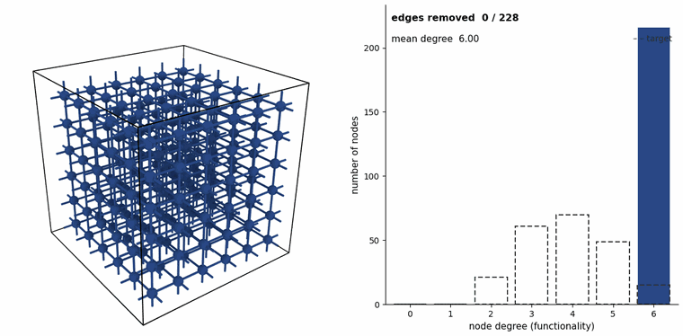
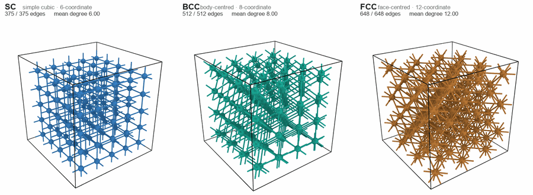
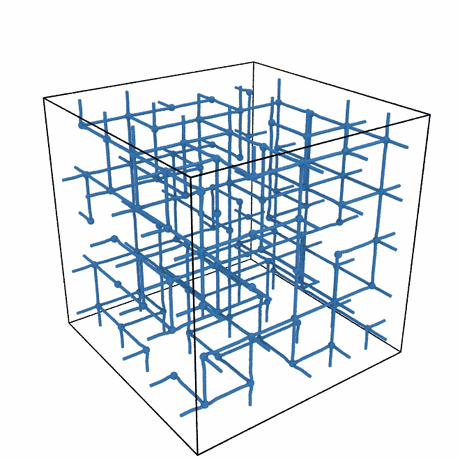
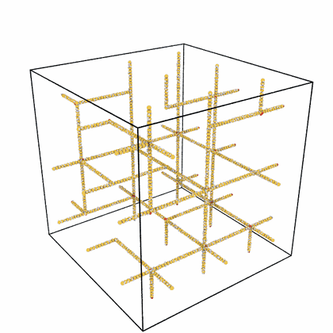
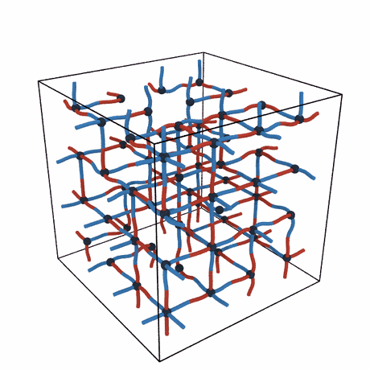
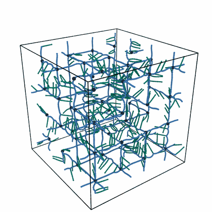
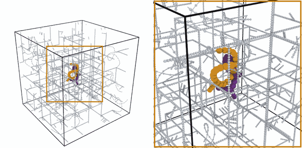
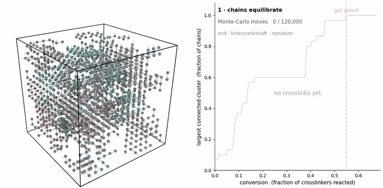

<p align="center">
  
</p>

<p align="center">
  <sub>The network comes out of topon's own sculpting generator. The letters are a colouring of the strands, the pinches inside them are real entanglement kinks, and the motion is a Kremer-Grest minimisation and equilibration run in LAMMPS. <a href="assets/logo/">How it was made</a></sub>
</p>

# topon

topon builds polymer and protein networks you can drop straight into LAMMPS.

You describe the network you want: how the junctions connect, how long the
strands are, what chemistry sits on them. topon turns that into a simulation box.
Connectivity comes first and chemistry is mapped onto it afterwards, so the same
graph can come out as a coarse-grained melt or as an all-atom system.

```
Topology → Analysis → Assignment → Chemistry → Conformation → Output
```

---

## How a network gets built

topon starts from a lattice of junctions and prunes it. A bare lattice gives every
junction the same functionality, which no real network has. The sculpting generator
removes edges until the degree distribution matches what you asked for:

<p align="center">
  
</p>

<sub>Left: nodes coloured by current degree, deep blue being 6-connected and
warming as they lose edges. Right: the degree histogram filling in against the
dashed target. This is the real algorithm, replayed from the edge-removal history
it recorded: 228 removals taking a 6x6x6 lattice from 648 edges to 420, mean degree
6.00 to 3.89.</sub>

It works from any of the lattices, and gets to the same place from each:

<p align="center">
  
</p>

<sub>SC, BCC and FCC start at 6-, 8- and 12-coordinate and all sculpt down to mean
degree 4.0. You get a tetrafunctional network whichever lattice you begin with.</sub>

Diamond is the fourth: 4-coordinate by construction, so a tetrafunctional
network needs no pruning at all. A fifth, `MIX`, overlays SC, BCC and FCC
sites at fractions you choose, which turns a single junction-spacing into
several and spreads the strand end-to-end distances accordingly. Any axis
can be made open instead of periodic, giving a slab with a free surface.

---

## What comes out

The as-built network is deliberately unphysical. Strands are strung taut between
junctions, so their bonds start far too short: about 5x in the coarse-grained case,
2.5x all-atom. MD fixes that. The chains coil out to their natural length and the
lattice becomes a melt, carrying the connectivity you asked for with it.

<table>
<tr>
<td width="50%"></td>
<td width="50%"></td>
</tr>
<tr>
<td><b>Coarse-grained.</b> Kremer-Grest, 5 125 beads, 250 strands. Bonds go from
0.17&nbsp;σ to 0.97 as the lattice coils into a melt.</td>
<td><b>All-atom.</b> The same construction in DREIDING PDMS, 10 896 atoms. Gold
silicon and red oxygen trace the siloxane backbone. Bonds go from 0.44&nbsp;Å to 1.12.</td>
</tr>
</table>

<sub>Both loop forward and back. Higher-quality MP4s:
<a href="assets/gallery/anim/cg_arc.mp4">CG</a>,
<a href="assets/gallery/anim/atom_arc.mp4">all-atom</a>.</sub>

---

## Things you can put on the strands

**Copolymer sequences.** Block, random or alternating, set per strand at build
time and carried into the melt.

<p align="center">
  
  
</p>

<sub>Left: a block copolymer. Every strand is half A (red) and half B (blue), and
the pattern survives the melt because sequence belongs to the chain, not to the
geometry. Right: dense side chains (teal) branching off a blue backbone, 292 grafts
of DP&nbsp;6.</sub>

**Entanglements.** Ask for a number of entanglements and topon pushes pairs of
strands off their lattice edges so they hook through each other. Below is one of
them, shown in the network and up close while it relaxes:

<p align="center">
  
</p>

<sub>The two entangled chains are gold and violet, everything else grey. On the
lattice they form a tight hooked crossing, closest approach about 0.4&nbsp;σ. As the
network melts they open into interlocked coils, still hooked.</sub>

You can also inject loop defects, meaning parallel edges between junctions that
are already connected, with valence protection so a junction never ends up
over-coordinated. POSS chain caps come with real Si₈O₁₂ cage chemistry. Caps only:
POSS at an internal junction is a known bug, and `topon doctor` will tell you so.

---

## Protein networks

The protein side is **topro**, implemented in `topon.protein_network`. Give it a
residue sequence and a repeat count and it builds a crosslinked protein network,
solvated and ready to run, in either MARTINI 3 or CHARMM36m all-atom.

```bash
# a MARTINI 3 protein network: sequence, repeats, chains, water and salt
python -m topon.protein_network generate \
    --block-seq GRGDSPYAAAAAAAAA --n-repeats 12 --n-chains 24 \
    --water-density 10 --n-na-ions 20 --n-cl-ions 20 --output ./run
```

`--water-density` is in beads per nm³; 10 is bulk MARTINI water and 0 gives you a
dry system. `sweep` runs a series of water contents into separate directories,
which is how you get a hydration series without hand-editing anything.

Connectivity comes from a lattice chain-growth model in `bfm.py`: self-avoiding
walks with excluded volume, equilibrated by Monte-Carlo moves, then crosslinked at
regularly spaced sites along each chain until the network percolates.

<p align="center">
  
</p>

<sub>First the chains move: end moves, kink/crankshaft, reptation. Then crosslinks
form (red) and the clusters merge, with the teal giant cluster growing until it
spans everything. The curve tracks the largest cluster against conversion. The
marked line is where the <i>last</i> chain joins, at conversion 0.55; the giant
component passes half the chains much earlier, around 0.14.</sub>

For all-atom work the CHARMM36m builder takes the same sequence and repeats and
writes a solvated system with salt. With `--physical-backbone` it places the
backbone from the force field's own internal-coordinate tables, giving correct
L-chirality and trans omega with a tunable X-Pro *cis* fraction, plus restraints
that hold both through minimisation. It reads a topology file written by the
previous step, so it takes two commands:

```bash
python -m topon.protein_network topology \
    --block-seq GRGDSPYAAAAAAAAA --n-repeats 18 --output topo.json

python -m topon.protein_network.charmm.build_systems \
    --topology topo.json --block_seq GRGDSPYAAAAAAAAA --n_repeats 18 \
    --water_contents 84 --salt_conc 0.15 --physical-backbone --output ./charmm_run
```

`--physical-backbone` is off by default, which gives the older jittered placement.
See [`examples/demos/protein/charmm/`](examples/demos/protein/charmm/) for a
scripted version of both steps.

Dityrosine crosslinks are placed at build time as harmonic bonds. If you would
rather form them during the simulation instead, calling `bfm.generate_topology`
from Python with `crosslink_method="none"` gives you the uncrosslinked structure
to start from (that one is a Python-API option, not a CLI flag).

---

## Installation

```bash
git clone https://github.com/lynspica/topon-dev.git
cd topon-dev
pip install -e .
```

LAMMPS is only needed to *run* what topon writes, not to generate it.

## Getting started

```bash
topon init --output my_run.json        # starter config
topon generate my_run.json --output ./runs
```

`topon` on its own opens an interactive session. `topon doctor` checks a config
before you run it, `topon inspect` summarises what came out, and `topon recipes`
lists worked examples. Ready-made configs are in [`examples/demos/`](examples/demos/).

## Tests

```bash
pytest -m fast              # 184 unit tests, well under a minute
pytest -m "fast or smoke"   # + end-to-end at small scale
```

Smoke tests run LAMMPS if `lmp` is on your PATH and skip it otherwise. There is
also a regression tier that compares against reference runs in `tests/output/`;
that directory is gitignored, so those tests skip on a fresh clone until you
generate the references locally.

## Documentation

| | |
|---|---|
| [docs/USAGE.md](docs/USAGE.md) | CLI reference, APIs, recipes, config schema |
| [docs/ARCHITECTURE.md](docs/ARCHITECTURE.md) | How the six stages fit together |
| [docs/DEVELOPMENT.md](docs/DEVELOPMENT.md) | Version history and conventions |
| [docs/JOURNAL.md](docs/JOURNAL.md) | Dated engineering notes |
| [AGENTS.md](AGENTS.md) | Onboarding for AI assistants |
| [assets/gallery/](assets/gallery/) | Where the animations came from, and how to rebuild them |

## License

Proprietary / internal use.
