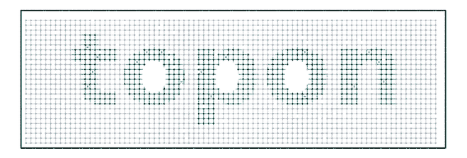

# The topon header figure

The banner at the top of the repo README is not an illustration — every element
is produced by topon itself, then run through LAMMPS.



## What you are looking at

| element | where it comes from |
|---|---|
| the network | `topon.topology.generator_python.PythonTopologyGenerator` — the strict-sculpting algorithm, on an 84×26×2 simple-cubic slab |
| its irregularity | topon's own sculpting stage 4, thinning 10 920 → 9 500 strands (`degree_distribution = "e:9500"`), giving a real degree spread (≈5/4/3/2) instead of a perfect lattice |
| the letters | a *colouring* — beads are teal iff they fall inside the "topon" glyph outline. Nothing holds them in letter shape |
| the counters (o, o, p) | carved as **vacancies**: the glyph fill is rasterised, the exterior flood-filled inward, and whatever non-ink the fill cannot reach is enclosed — exactly the holes |
| the pinches in the strokes | **real entanglements**: `assignment.entanglements.find_crossing_candidates` pairs each strand with its nearest disjoint (≈parallel) neighbour, realised with topon's own `KinkParams` — the two strands neck together, cross with `overshoot`, one passing over and one under by `z_amp`, under a Gaussian of width `sigma` so the ends stay pinned |
| the motion | a Kremer–Grest run in LAMMPS: soft push-off → **FENE + WCA** minimisation → short Langevin NVT. The same CG model the README advertises |

## Reproducing it

```bash
python make_logo_data.py --variant entangled     # topology + letters + kinks -> LAMMPS data
python make_kg.py topon_entangled.data           # rescale to KG units (×4.85) + write in.kg_logo
lmp -in in.kg_logo                               # minimise + equilibrate, dumping traj.lammpstrj
"C:/v/ovito/Scripts/python.exe" render_traj.py   # frames/ via OVITO Tachyon
```

Then assemble `frames/` into the boomerang loop (see *Loop* below).
`render_variants.py` renders the static stills in `variants/`.

Variants (`--variant`): `clean`, `copolymer`, `entangled`, `organic`,
`organic_copoly`. Stills for each are in [`variants/`](variants/);
[`variants/zoom_kink2.png`](variants/zoom_kink2.png) is a close-up of the kink
geometry.

## Design notes

**The loop is a boomerang, and it is seamless by construction.** The cycle is
`frames + frames[-2:0:-1]` — forward, then back *excluding both endpoints*. The
last frame is index 1 and the first is 0, so the wrap is a one-frame step,
identical to every interior step: no stutter, no jump. Forward is the real
minimisation and equilibration; backward is that trajectory reversed.

**The camera is front-on, not the group's 3/4 house view.** A wordmark has to
read, and the 3/4 view shears the letterforms illegible. This is a deliberate
deviation from the `ovito-render` house style.

**Kink pairs are filtered to in-plane ones.** The slab is two layers deep, so a
strand's nearest neighbour is often the one stacked *behind* it; those pairs get
pulled along z — the viewing axis — and the kink collapses to a dot. Only pairs
with |Δz| ≈ 0 are used (984 of 1 574 candidates), so the pull is in-plane and
`z_amp` puts one strand in front and one behind: a visible X.

**Kink sites are chosen by farthest-point sampling**, not topon's random draw,
so the 75 kinks spread evenly across the wordmark. Candidate-finding and the
kink geometry are topon's; only *which* sites get used is logo-specific, because
even coverage is a design requirement and not a physical one.

**GIF, not MP4, for the header.** GitHub renders a repo-relative GIF reliably;
`<video>` with a relative path does not. `anim/topon_loop_web.mp4` (0.81 MB) is
kept for slides and is both smaller and cleaner than the 2.3 MB GIF — 40 k beads
of fine texture is high-entropy detail that a 32-colour palette bands badly.
`anim/topon_header.png` is a 2× static poster (the relaxed end frame), for the
repo's social-preview card, which never animates.

## Caveats

* Glyph outlines come from matplotlib's `TextPath`, **not PIL**. PIL's FreeType
  is broken on this machine: `ImageFont.truetype()` loads any font and reports
  sane bounding boxes but rasterises `.notdef` ("tofu") boxes for every
  character — including matplotlib's own bundled DejaVu.
* matplotlib's compound-path `contains_points` **fills glyph counters**: an "o"
  has two correctly-wound contours (outer CW, counter CCW), yet
  `contains_point` is `True` at the hole's centre. `glyph_contains()` tests each
  contour and XORs (even-odd rule) so the holes are excluded.
* **`KinkParams` used to be ignored — fixed.** For a long time `pipeline.py`
  called `calculate_entangled_kink` without `params` or `num_entanglements`, so
  the helper fell back to its hardcoded `0.2 / 0.5 / 0.15` and the multi-lobe
  path was dead. It was invisible because those hardcoded values happen to equal
  `KinkParams`' schema defaults — you only saw it by setting a non-default and
  watching it be ignored. Both are now threaded through (`pipeline.py` CG and
  atomistic, plus `workflows/cg_network.py`), so `kink_params` and
  `entanglement_count` reach the geometry. Passing the schema defaults reproduces
  the old output exactly, so existing runs are unchanged.
  (An earlier revision of this file claimed the pipeline realised no kink
  geometry at all and that `make_logo_data.py` was the only code that did. That
  was wrong — `chemistry/builder.py` only counts pairs, but Stage 4 in
  `pipeline.py` does the displacement.)
